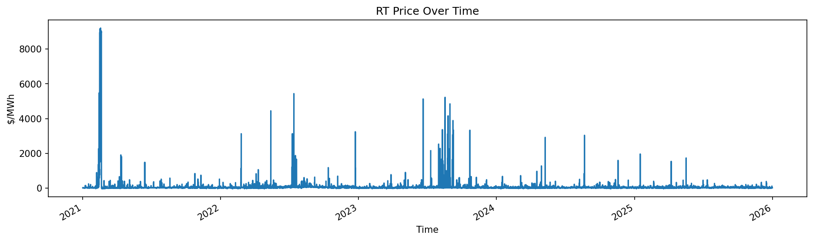
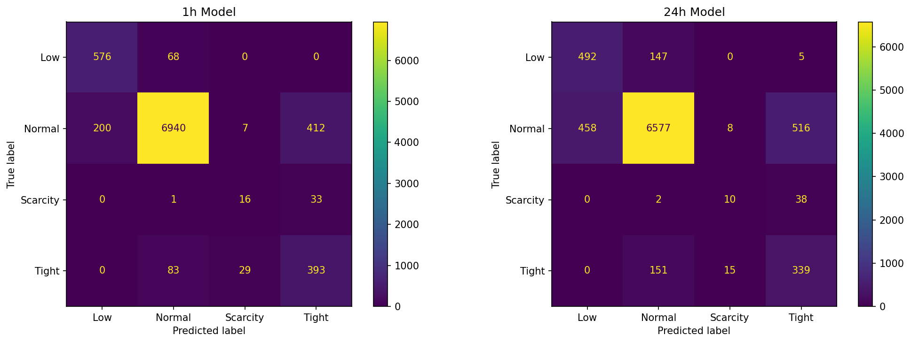
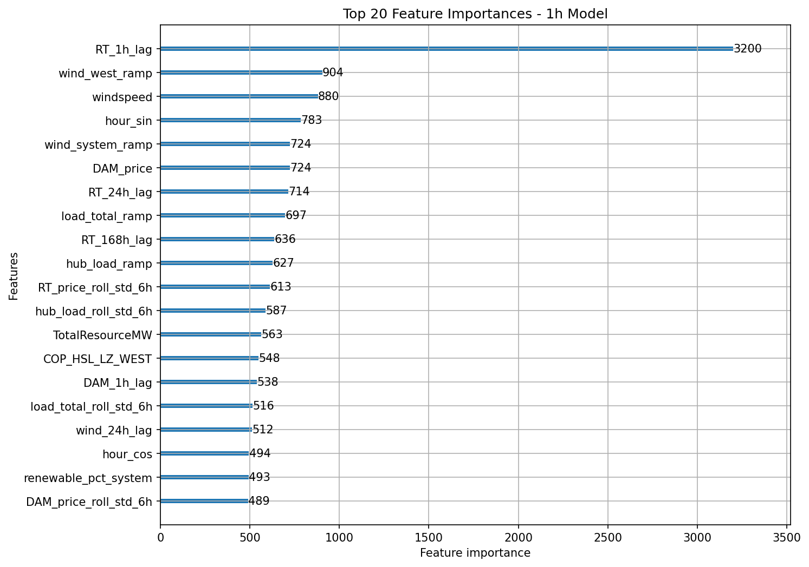

# ERCOT Grid Regime Classification

Predicting ERCOT grid stress conditions to optimize flexible load dispatch for Bitcoin miners, datacenters, and battery storage operators.

## Problem

Electricity prices in ERCOT are volatile — prices sit near $20-50/MWh most hours, then spike to $200-9,000/MWh during grid stress events. Flexible load operators (Bitcoin miners, datacenters, batteries) need to know **when** these spikes will happen so they can curtail operations and avoid buying expensive power — or sell power back to the grid at premium rates.



Predicting exact prices is noisy and hard. Instead, this project classifies grid conditions into four **regimes** that map directly to dispatch actions:

| Regime | Price Range | Action |
|--------|-----------|--------|
| **Low** | ≤ $0/MWh | Full power — cheap/negative prices, maximize consumption |
| **Normal** | $0–75/MWh | Operate — standard operations |
| **Tight** | $75–200/MWh | Reduce — lower non-critical load |
| **Scarcity** | > $200/MWh | Curtail — shut down flexible load, sell power back |

## Approach

Two LightGBM classifiers built for different planning horizons:

**1-Hour Ahead Model** — Real-time dispatch decisions
- F1: 0.91 | Tight Recall: 0.78 | Scarcity Recall: 0.32
- Primary use: battery arbitrage, BTC mining real-time curtailment
- Top features: RT price lag (1h), wind ramp rates, windspeed, load ramp

**24-Hour Ahead Model** — Day-ahead planning
- F1: 0.86 | Tight Recall: 0.67 | Scarcity Recall: 0.20
- Primary use: datacenter workload scheduling, DAM bidding, mining operations planning
- Top features: wind forecast (STWPF), DAM price, RT price rolling stats, outages

## Business Value — Backtest Results (2025)

Using a 200MW facility on 2025 test data:

| Operator | Model | Always-On Cost | Model-Guided Cost | Savings |
|----------|-------|---------------|-------------------|---------|
| BTC Miner | 1h | $57.7M | $40.2M | **$17.5M** |
| BTC Miner | 24h | $57.7M | $41.2M | **$16.5M** |
| Datacenter | 1h | $57.7M | $54.2M | **$3.5M** |
| Datacenter | 24h | $57.7M | $54.6M | **$3.1M** |

Datacenter savings are lower because only flexible load (35%) is curtailed — critical infrastructure stays online.

## Data

5 years of ERCOT market data (2021–2025), ~43,000 hourly observations:

- **RT & DAM prices** — HB_WEST hub (Selenium scraper + ERCOT API)
- **System load** — West zone + system total actual and forecast
- **Wind generation** — West zone WGRPP, STWPF, COP_HSL + system-wide
- **Solar generation** — System-wide PVGRPP, STPPF, COP_HSL
- **Outages** — Zonal and system-wide planned/forced outages
- **Weather** — Temperature, humidity, windspeed, precipitation (Open-Meteo API, Midland TX)

## Feature Engineering

67 features built from raw data:

- **Time features**: Hour, day of week, month, weekend flag, cyclic encoding (sin/cos)
- **Price lags**: RT and DAM at 1h, 24h, 168h horizons
- **Rolling statistics**: 6h and 24h rolling mean/std for prices, load, wind
- **Ramp rates**: Hour-over-hour change in load, wind, RT price
- **Engineered signals**: Net load (demand minus renewables), renewable penetration ratio
- **Data quality**: Outlier capping at 99th percentile, forward/backfill for sparse nulls

## Model Selection

Three classifiers compared with default hyperparameters, then the winner (LightGBM) tuned via GridSearchCV with TimeSeriesSplit:

| Model | Weighted F1 | Scarcity Recall | Tight Recall |
|-------|------------|-----------------|--------------|
| Logistic Regression | 0.82 | 0.18 | 0.04 |
| Random Forest | 0.92 | 0.06 | 0.33 |
| **LightGBM** | **0.93** | **0.18** | **0.53** |

After tuning with `class_weight='balanced'` and removing Uri from 1h training:

| Model | Weighted F1 | Scarcity Recall | Tight Recall |
|-------|------------|-----------------|--------------|
| **1h (final)** | **0.91** | **0.32** | **0.78** |
| **24h (final)** | **0.86** | **0.20** | **0.67** |





## Key Findings

- **No single feature predicts grid stress** — it's the combination of high load + low wind + outages. Tree-based models capture these interactions automatically.
- **Wind and solar suppress prices non-linearly** — low correlation with RT price doesn't mean they're useless features. LightGBM picks up threshold effects that linear models miss.
- **Winter Storm Uri (Feb 2021) added noise** — removing it from 1h training improved scarcity recall. The extreme patterns (frozen generators, $9,000 cap prices) don't generalize to typical scarcity events.
- **Most scarcity misses are classified as Tight, not Normal** — the model fails gracefully. Even when it underestimates severity, it still triggers load reduction.
- **1h model relies on price momentum, 24h model shifts to fundamentals** — mirrors how traders shift from technical to fundamental analysis as the horizon extends.
- **Scarcity detection is fundamentally limited** by sample size (~200 hours in 5 years). In production, supplement with ERCOT operational alerts.

## Project Structure

```
ercot_forecasting_project/
├── src/
│   ├── data/
│   │   ├── preprocess.py              # Data cleaning pipeline
│   │   ├── import_Ercot_historical_data.py  # Selenium scraper (2021+)
│   │   └── gridstatus_import.py       # GridStatus API (2023+, production)
│   ├── features/
│   │   └── feature_engineering.py     # Feature building pipeline
│   └── models/
│       ├── predict.py                 # Production prediction
│       └── decision_layer.py          # Dispatch logic + backtesting
├── notebooks/
│   ├── 01_eda.ipynb                   # Exploratory data analysis
│   └── 02_modeling.ipynb              # Model training + evaluation
├── models/                            # Saved model artifacts (.pkl)
├── data/                              # Raw, interim, processed (not in repo)
├── README.md
└── .gitignore
```

## How It Works — Production Flow

1. **Ingest** — Pull latest ERCOT data via GridStatus API
2. **Clean** — `preprocess.py` standardizes timestamps, handles hour-24, deduplicates forecast vintages
3. **Features** — `feature_engineering.py` builds lags, rolling stats, ramp rates, regime labels
4. **Predict** — `predict.py` loads saved models, outputs regime forecast per hour
5. **Dispatch** — `decision_layer.py` maps regimes to operator-specific actions

## Tech Stack

Python, Pandas, LightGBM, scikit-learn, Matplotlib, Selenium, Open-Meteo API, GridStatus

## Future Work

- Battery storage backtest with charge state tracking and round-trip efficiency
- Streamlit dashboard for real-time regime visualization
- Automated daily pipeline via GitHub Actions
- Incorporate ERCOT operational alerts (EEA levels, operating reserves) as leading indicators
- Expand training data to 10+ years for better rare event detection
- Two-stage binary classification (Normal vs Stress → Tight vs Scarcity)